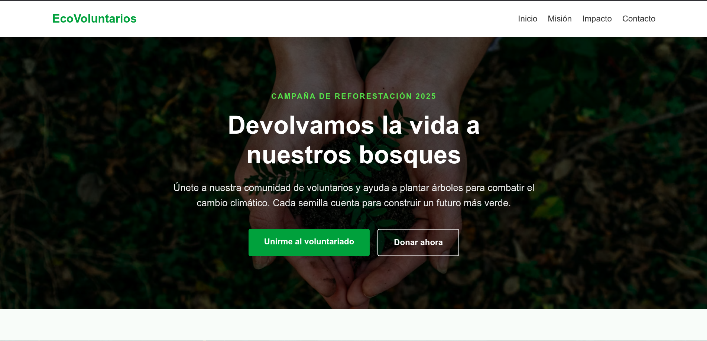
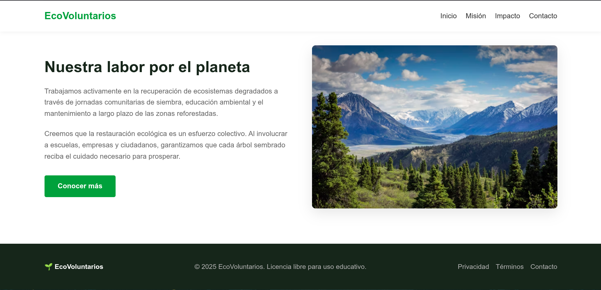

# EcoVoluntarios - Landing Page de Reforestación

Este proyecto consiste en el desarrollo de una Landing Page responsiva para una organización de voluntarios enfocada en la conservación ambiental y reforestación. El diseño ha sido construido utilizando estándares modernos de desarrollo web con tecnologías nativas (HTML5 y CSS3).

Este desarrollo forma parte de una prueba técnica orientada a demostrar habilidades de maquetación limpia, semántica y diseño adaptativo (*responsive*).

---

## 📸 Captura de Pantalla





---

## 🚀 Características del Proyecto

- **HTML5 Semántico:** Uso de etiquetas estructurales (`<header>`, `<main>`, `<section>`, `<footer>`) para optimizar el SEO y la accesibilidad.
- **Diseño Responsivo:** Adaptado para dispositivos móviles, tabletas y ordenadores de escritorio mediante *Media Queries* y técnicas modernas de distribución como *Flexbox* y *CSS Grid*.
- **Capa de Optimización Visual:** Implementación de un fondo con superposición oscura (*overlay*) en la sección *Hero* para garantizar un alto contraste y legibilidad de los textos.
- **Interactividad Básica:** Transiciones suaves y efectos de interacción (*hover*) en los botones de llamada a la acción.

---

## 🛠️ Instrucciones de Ejecución Local

No requiere de compiladores, dependencias externas ni entornos de ejecución complejos. Siga estos pasos para verlo de forma local:

1. **Clonar o descargar el repositorio:**
   ```bash
   git clone https://github.com/SergioRC-04/Assessment_OIV.git

2. **Navegar a la carpeta del proyecto:**
   ```bash
   cd nombre-del-repositorio

3. **Abrir en el navegador:**
   Simplemente haga doble clic sobre el archivo index.html o arrástrelo a una pestaña abierta de su navegador preferido.
